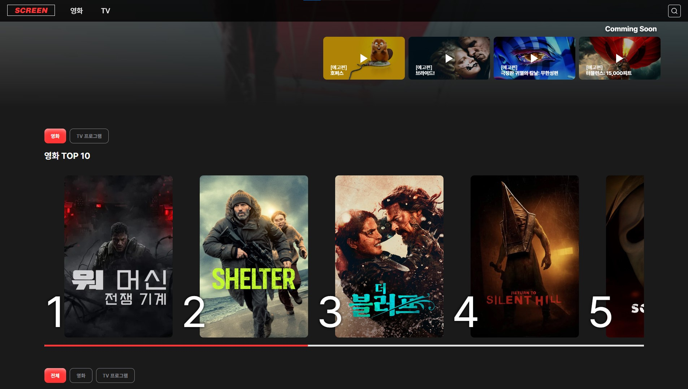

<h2>✨ 소개</h2>

이 프로젝트는 TMDB API를 기반으로 영화와 TV 콘텐츠 정보를 탐색할 수 있는 웹 서비스입니다.

사용자는 최신 인기 작품, 추천 콘텐츠, 배우 필모그래피 등을 확인하고 다양한 OTT 플랫폼에서 제공되는 작품 정보를 쉽게 찾아볼 수 있습니다.

직관적인 UI와 인터랙션을 통해 콘텐츠를 탐색하는 재미를 제공하며, 검색 기능과 필터링을 통해 원하는 영화와 TV 프로그램을 빠르게 발견할 수 있습니다. 또한 가로 슬라이드, 팝업 상세 정보 등 다양한 UI 요소를 활용하여 사용자 경험을 향상시키는 것을 목표로 합니다.

        
<h2>🔗 배포 URL</h2>

  <a href="https://dl-xogus.github.io/screen/">https://dl-xogus.github.io/screen/</a>

<h2>📑 프로젝트 요약</h2>
<h3>1. 주제</h3>
<ul>
  <li>TMDB API를 활용하여 영화와 TV 콘텐츠 정보를 탐색할 수 있는 웹 서비스 개발</li>
  <li>인기 작품, 추천 콘텐츠, 배우 정보 및 필모그래피 등을 한 곳에서 확인할 수 있는 콘텐츠 탐색 플랫폼 구현</li>
</ul>

<h3>2. 목표</h3>
<ul>
  <li>영화 및 TV 콘텐츠 정보를 직관적으로 탐색할 수 있는 UI/UX 구현</li>
  <li>외부 API를 활용한 데이터 기반 웹 서비스 개발 경험</li>
  <li>다양한 콘텐츠를 빠르게 탐색할 수 있도록 검색, 추천, 필터 기능 제공</li>
  <li>협업을 통해 Git 기반 프로젝트 관리 및 개발 프로세스 경험</li>
</ul>

<h3>3. 핵심 기능</h3>
<ul>
  <li>🔎 콘텐츠 검색 기능 (영화 / TV 프로그램)</li>
  <li>🎬 상세 정보 제공 (줄거리, 평점, 장르, 개봉일, 출연 배우)</li>
  <li>👤 인물 정보 및 필모그래피 조회</li>
  <li>📺 OTT 제공 플랫폼 정보 확인 (Netflix, Apple TV, Disney+, TVING, wavve)</li>
  <li>⭐ 추천 및 인기 콘텐츠 리스트 제공</li>
  <li>🖱 가로 슬라이드 및 드래그 인터랙션 UI</li>
</ul>

<h2>📆 기간 및 인원</h2>
<ul>
  <li>2026.01.31-2026.03.09 휴일 제외 총 24일</li>
  <ul>
    <li>기초 데이터 수집 및 화면 설계 시간 : 8일</li>
    <li>개발 및 테스트 기간 : 16일</li>
  </ul>
  <li>팀원 : 3명</li>
</ul>

<h2>👩🏻‍🤝‍🧑🏻 팀원 소개</h2>
<table>
  <thead>
    <tr>
      <th>이름</th>
      <th>주요 페이지</th>
      <th>해당</th>
    </tr>
  </thead>
  <tbody>
    <tr>
      <td>이태현</td>
      <td>메인 페이지, 리스트 페이지, 인물 상세 팝업</td>
      <td>✔</td>
    </tr>
    <tr>
      <td>이현주</td>
      <td>검색 페이지, 추천 컨텐츠 팝업</td>
      <td></td>
    </tr>
    <tr>
      <td>조성경</td>
      <td>영화 상세 팝업, TV 상세 팝업</td>
      <td></td>
    </tr>
  </tbody>
</table>

<h2>💡 주요 기능</h2>
<h3>1. 콘텐츠 탐색</h3>
<ul>
  <li>영화 및 TV 프로그램 검색</li>
  <li>검색 결과 페이지 제공</li>
  <li>검색어 기반 콘텐츠 필터링</li>
</ul>

<h3>2. 콘텐츠 정보 확인</h3>
<ul>
  <li>영화 / TV 상세 정보 제공</li>
  <li>줄거리, 평점, 장르, 개봉일 확인</li>
  <li>출연 배우 정보 제공</li>
  <li>관련 콘텐츠 / 에피소드 정보 확인</li>
</ul>

<h3>3. 인물 정보</h3>
<ul>
  <li>인물 상세 페이지</li>
  <li>인물 필모그래피 확인</li>
  <li>영화 / TV 출연 작품 목록 제공</li>
</ul>

<h3>4. 콘텐츠 추천</h3>
<ul>
  <li>인기 콘텐츠 목록 제공</li>
  <li>추천 콘텐츠 제공</li>
  <li>최신순 콘텐츠 정렬</li>
</ul>

<h3>5. OTT 제공 정보</h3>
<ul>
  <li>Netflix</li>
  <li>Apple TV</li>
  <li>Disney+</li>
  <li>TVING</li>
  <li>wavve</li>
</ul>

각 컨텐츠가 어떤 OTT에서 시청 가능한지 확인 가능

<h3>6. 인터랙션 UI</h3>
<ul>
  <li>가로 슬라이드 콘텐츠 리스트</li>
  <li>드래그 스크롤</li>
  <li>상세 정보 팝업</li>
  <li>검색 UI 인터랙션</li>
</ul>

<h2>🗂️ 폴더 구조</h2>
<pre>
  <code>
    📦 project
     ┣ 📂 css
     ┃ ┣ 📂 page
     ┃ ┃ ┣ popup-com.css
     ┃ ┃ ┣ popup-filmography.css
     ┃ ┃ ┣ popup-movieDetails.css
     ┃ ┃ ┣ popup-recommendList.css
     ┃ ┃ ┣ popup-tvDetails.css
     ┃ ┃ ┣ sub-list.css
     ┃ ┃ ┗ sub-search.css
     ┃ ┣ index.css
     ┃ ┣ common.css
     ┃ ┗ reset.css
     ┣ 📂 js
     ┃ ┣ sub-search.js
     ┃ ┣ sub-list.js
     ┃ ┣ popup-recommendList.js
     ┃ ┣ index.js
     ┃ ┗ common.js
     ┣ 📂 pages
     ┃ ┣ popup-filmography.html
     ┃ ┣ popup-movieDetails.html
     ┃ ┣ popup-tvDetails.html
     ┃ ┣ popup-recommendList.html
     ┃ ┣ sub-list.html
     ┃ ┗ sub-search.html
     ┣ 📂 images
     ┣ index.html
     ┗ README.md
  </code>
</pre>

<h2>💻 개발 환경</h2>
<h3>1. Front-End</h3>
<table>
  <thead>
    <tr>
      <th>사용기술</th>
      <th>설명</th>
      <th>Badge</th>
    </tr>
  </thead>
  <tbody>
    <tr>
      <td>HTML</td>
      <td>웹 페이지 구조 및 마크업</td>
      <td></td>
    </tr>
    <tr>
      <td>CSS</td>
      <td>레이아웃 및 스타일링</td>
      <td></td>
    </tr>
    <tr>
      <td>JavaScript</td>
      <td>DOM 조작 및 이벤트 처리</td>
      <td></td>
    </tr>
    <tr>
      <td>jQuery</td>
      <td>동적 기능 구현 및 데이터 처리</td>
      <td></td>
    </tr>
  </tbody>
</table>

<h3>2. API</h3>
<table>
  <thead>
    <tr>
      <th>사용기술</th>
      <th>설명</th>
      <th>Badge</th>
    </tr>
  </thead>
  <tbody>
    <tr>
      <td>TMDB API</td>
      <td>영화 및 TV 콘텐츠 데이터 제공</td>
      <td></td>
    </tr>
  </tbody>
</table>

<h3>3. 개발 도구</h3>
<table>
  <thead>
    <tr>
      <th>사용기술</th>
      <th>설명</th>
      <th>Badge</th>
    </tr>
  </thead>
  <tbody>
    <tr>
      <td>Visual Studio Code (VS Code)</td>
      <td>코드 편집기(에디터)</td>
      <td></td>
    </tr>
    <tr>
      <td>GitHub</td>
      <td>버전 관리</td>
      <td></td>
    </tr>
    <tr>
      <td>Figma</td>
      <td>디자인 & UI/UX</td>
      <td></td>
    </tr>
  </tbody>
</table>

<h2>📚 프로젝트 문서 자료</h2>
<table>
  <thead>
    <tr>
      <th>문서종류</th>
      <th>파일명</th>
      <th>설명</th>
    </tr>
  </thead>
  <tbody>
    <tr>
      <td>기초데이터수집 및 화면설계</td>
      <td><a href="https://www.figma.com/deck/UgdgzWfKtRBs6qfbbPirTy/%ED%94%84%EB%A1%9C%EC%A0%9D%ED%8A%B8-%EA%B8%B0%ED%9A%8D?node-id=103-243&t=XCdZSDvoEMrdgjC4-1">프로젝트 기획</a></td>
      <td></td>
    </tr>
    <tr>
      <td>디자인</td>
      <td><a href="https://www.figma.com/design/1UIgOuh1sJmWHh70Z2Qzmh/%EC%98%81%ED%99%94%ED%8C%80?node-id=0-1&t=9f5FGWik6AKkd5Rv-1">디자인</a></td>
      <td></td>
    </tr>
    <tr>
      <td>발표자료</td>
      <td></td>
      <td></td>
    </tr>
  </tbody>
</table>

<h1>이태현의 개발 상세</h1>
<h2>📑 요약</h2>
<ul>
  <li>담당</li>
  <ul>
    <li>메인 페이지</li>
    <li>헤더, 헤더 검색창, 푸터</li>
    <li>리스트 페이지</li>
    <li>인물 상세 팝업</li>
  </ul>
  <li>담당 페이지 상세</li>
  <ul>
    <li>index.html, index.css, index.js</li>
          → 영화, TV 장르 로컬스토리지 저장  
          → 메인 상단 개봉 예정 예고편 데이터 호출 및 출력  
          → Top 10 영화, TV 프로그램 버튼 토글 및 이벤트 기능  
          → Top 10 인기순 영화, TV 데이터 호출 및 출력  
          → 추천 콘텐츠 전체, 영화, TV 프로그램 버튼 토글 및 이벤트 기능  
          → 추천 콘텐츠 평점순 영화, TV 프로그램 데이터 호출 및 출력  
          → 영화, TV별로 랜덤 장르 3개 뽑기 및 출력   
    <li>common.css, common.js</li>
          → 헤더 구현  
          → 헤더 네비게이션바 클릭 시 리스트 페이지 넘김 기능  
          → 헤더 검색 아이콘 클릭 시 검색창 펼쳐짐 기능  
          → 헤더 검색창 아래 추천검색어 데이터 호출 및 출력  
          → 헤더 검색창 추천검색어 클릭 시 검색 페이지로 넘김 기능  
          → 푸터 구현  
          → 헤더, 푸터 로고 클릭 시 메인페이지로 이동 기능   
    <li>sub-list.html, sub-list.css, sub-list.js</li>
          → 헤더 네이게이션 바 클릭 시 영화, TV 토글 기능  
          → 리스트 정렬 탭 토글 기능  
          → 리스트 인기순, 평점순, 최근작품순 정렬 기능  
          → 사이드 메뉴 탭 펼치기, 접기 기능  
          → 사이드 메뉴 버튼 토글 기능  
          → 영화, TV 리스트 페이지별 장르 버튼 출력  
          → 사이드 메뉴 필터링 데이터 호출 및 출력  
          → More 버튼 클릭 시 영화데이터 호출 및 출력   
    <li>popup-filmography.html, popup-filmography.css</li>
          → 인물 데이터 호출  
          → 프로필 출력  
          → 대표작 출력  
          → 필모그래피 출력  
          → More 버튼 클릭 시 인물 필모그래피 데이터 호출 및 출력
  </ul>
</ul>

<h2>🧩 공통 js, css 제작</h2>
<ul>
  <li>📜common.js - 헤더 검색창 기능, 팝업 생성 기능</li>
  <li>📜common.css - 헤더, 헤더 검색창, 푸터 스타일</li>
</ul>

<h2>💥 트러블 슈팅</h2>
<h3>📌 영화/TV 콘텐츠 날짜 정렬 문제</h3>
<ol>
    <li>
        TMDB API에서 배우의 필모그래피 데이터를 가져올 때 영화와 TV콘텐츠가 함께 제공되었는데, 영화는 release_data, TV는 first_air_data 속성을 사용하여 날짜가 저장되어 있어 단순 정렬이 정상적으로 동작하지 않는 문제가 발생하였습니다.   
        *영화와 TV콘텐츠가 서로 다른 날짜 속성을 사용하고 있어 정렬 기준이 통일되지 않았음   
        ⇒ 해결방법: 두 속성 중 존재하는 값을 선택하도록 조건을 설정한 뒤 .sort((a, b) => {b-a})방식으로 최신순 정렬하였습니다.
    </li>
</ol>

<h3>📌 OTT 플랫폼 아이콘 중복 출력 문제</h3>
<ol>
    <li>
        콘텐츠의 OTT 제공 플랫폼을 표시할 때 동일한 플랫폼 아이콘이 여러 번 출력되는 문제가 발생하였습니다.   
        *TMDB API의 watch provider 데이터는 flatrate, rent, buy 세 가지 카테고리로 나누어 제공되는데, 동일한 OTT 서비스가 여러 카테고리에 동시에 포함되어 있었기 때문이다.   
        ⇒ 해결방법: 세 배열을 하나로 합친 뒤 provider_id 기준으로 중복을 제거하여 동일한 OTT 플랫폼은 한 번만 출력하도록 처리 하였습니다.
    </li>
</ol>

<h3>📌 가로 스크롤 영역 드래그 커서 깜빡임 문제</h3>
<ol>
    <li>
        메인 페이지 콘텐츠 영역에서 드래그 가능한 UI를 구현하는 과정에서 마우스를 이동할 때 커서 상태가 계속 변경되어 깜빡이는 문제가 발생하였습니다.   
        *mouseover 이벤트가 부모 요소뿐 아니라 내부의 모든 자식 요소에서도 반복적으로 발생했기 때문에 이벤트가 과도하게 실행되었습니다.   
        ⇒ 해결방법: closest() 매서드를 활용하여 실제 드래그 영역에 해당하는 요소에서만 이벤트가 실행 되도록 조건을 추가하였습니다.
    </li>
</ol>

<h3>📌 검색어 전달 시 URL 인코딩 문제</h3>
<ol>
    <li>
        검색 페이지로 이동할 때 검색어에 공백이나 특수문자가 포함되면 정상적으로 검색 결과가 출력되지 않는 문제가 발생하였습니다.   
        *검색어가 URL 파라미터로 전달되는 과정에서 공백이나 특수문자가 제대로 처리되지 않았기 때문이다.   
        ⇒ 해결방법: encodeURIComponent() 함수를 사용하여 검색어를 URL에 안전하게 전달하도록 처리하였습니다.
    </li>
</ol>

<h3>📌 OTT 제공 국가 데이터 누락 문제</h3>
<ol>
    <li>
        일부 콘텐츠에서 OTT 제공 플랫폼 아이콘이 표시되지 않는 문제가 발생하였습니다.   
        *TMDB watch provider 데이터는 국가별로 제공되는데, 특정 콘텐츠는 KR 지역 데이터가 존재하지 않는 경우가 있었다.   
        ⇒ 해결방법: 옵셔널 체이닝과 기본값을 설정하여 데이터가 없는 경우에도 오류가 발생하지 않도록 처리하였습니다.
    </li>
</ol>
